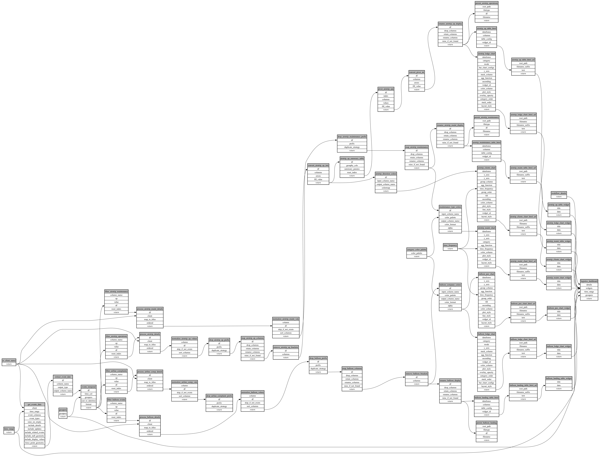

```
# AUTOGENERATED BY ECOSCOPE-WORKFLOWS; see fingerprint in README.md for details

```

```yaml
# fingerprint:
artifacts_sha256_basic: bc3e6b638426b2be096e43d10ad9f8c5a5d19c6e024ab879a8a5a7f92aec241f
artifacts_sha256_strict: f7735b48af7f55a3a09d1b43c9af0e9afab793058eafed7e6852e30931ce15b7
installed_requirements:
- channel: https://repo.prefix.dev/ecoscope-workflows/
  name: ecoscope-platform
  version: {version: ==2.15.1}
- channel: https://repo.prefix.dev/ecoscope-workflows-custom/
  name: ecoscope-workflows-ext-custom
  version: {version: ==0.1.0rc14}
- channel: https://repo.prefix.dev/ecoscope-workflows-custom/
  name: ecoscope-workflows-ext-ste
  version: {version: ==0.0.0rc1}
- channel: https://repo.prefix.dev/ecoscope-workflows-custom/
  name: ecoscope-workflows-ext-mnc
  version: {version: ==1.0.0}
- channel: https://repo.prefix.dev/ecoscope-workflows-custom/
  name: ecoscope-workflows-ext-wwf-virunga
  version: {version: ==0.0.1}
- channel: conda-forge
  name: pydeck
  version: {version: ==0.9.2}
- channel: conda-forge
  name: opentelemetry-sdk
  version: {version: ==1.45.0}
params_sha256: 26be0df5f6876f0e70e5f5e67ac494974adabe128bd9c9ac3feb10ea80bd2627
spec_sha256: b511943ccff434fc45516551b6cac8863b48b5d8e450ff79faaef692161f89f3

```

# ecoscope-workflows-logistics-report-workflow


